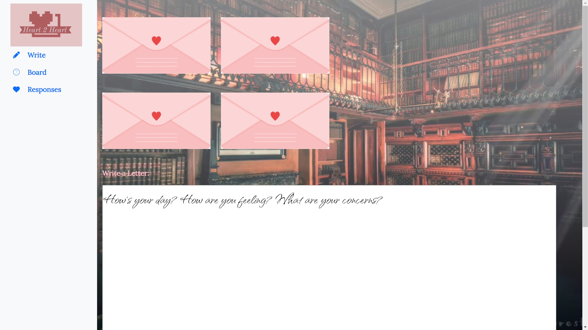

# "Heart2Heart"


## Table of Contents

- [Description](#description)
- [Installation](#installation)
- [Technologies](#technologies-used)
- [Deployed Link](#link)
- [Usage](#usage)
- [User Information](#user-information)
- [Credits](#credits)
- [Questions](#questions)
- [License](#license)

## Description

A personal journalling application that will allow users to create accounts and post journal entries to a dashboard.

### Roadmap

The original concept for Heart2Heart was an application that would allow users to send anonymous letters out into the world. These letters would then be "dynamically" shown to other users, giving them the ability to respond in kind anonymously. Like a random pen-pal per se, where you have the ability to respond to a metaphorical "message in a bottle". The core focus would be around mental health and cultivating positive, encouraging, empathetic conversations.

1. Phase One - Finish building out personal journaling functionality

2. Phase Two - Add ability for users to view other users letters. Like from a bulletin board interface, from which they can respond.

3. Phase Three - Polish UI. Add better logic for how letters are displayed to users.

4. Phase Four - Integrate some more libraries and APIs to improve aesthetics and UX.

## Installation

```ruby
npm i
```

## Technologies Used

- React
- MongoDB
- Express
- Node
- Apollo/Graphql
- JWT Authentication
- Mongoose ODM
- JSX

## Deployed Link

[Heart2Heart](https://heart-2-heartz.herokuapp.com/)

Currently our deployed link does not lead properly to the login page, however it does on a local server. Clone the repositry and run `npm run develop` to start your local server.

## Usage

#### Login/Signup Page


#### Homepage



### Code Snippets

Below is our TypeDefs and our resolvers for our User model - allowing us to create a User upon sign-up.

```ruby
const typeDefs = gql`
  type User {
    _id: ID!
    username: String!
    email: String!
    password: String!
    affirmations: [String]
  }

  type Auth {
    token: ID!
    user: User
  }
  type Query {
    me: User
  }
  type Mutation {
    removeUser(id: ID!): User
    updateUser(id: ID!, username: String!, email: String!, password: String!, affirmations: [String]): User
    login(email: String!, password: String!): Auth
    addUser(username: String!, email: String!, password: String!): Auth
  }
`;

```

```javascript
 Mutation: {
    addUser: async (parent, args) => {
      const user = await User.create(args);
      const token = signToken(user);
      return { token, user };
    },

    login: async (parent, { email, password }) => {
      const user = await User.findOne({ email });
      if (!user) {
        throw new AuthenticationError("Invalid credentials, user not found.");
      }
    },
```

These are the mutation hooks on the client side that we call in our login and sign-up components.

```javascript
export const LOGIN = gql`
  mutation login($username: String!, $email: String!, $password: String!) {
    login(username: $username, email: $email, password: $password) {
      token
      user {
        _id
      }
    }
  }
`;

export const ADD_USER = gql`
  mutation addUser($username: String!, $email: String!, $password: String!) {
    addUser(username: $username, email: $email, password: $password) {
      token
      user {
        _id
        username
        email
      }
    }
  }
`;
```

This is our Sign-up component which utlizes these mutations based on user input and returns back some conditional JSX content.

```javascript
function Signup(props) {
  // set initial form state
  const [userFormData, setUserFormData] = useState({
    username: "",
    email: "",
    password: "",
  });
  // set state for form validation
  const [validated] = useState(false);
  // set state for alert
  const [showAlert, setShowAlert] = useState(false);

  const [addUser, { error }] = useMutation(ADD_USER);

  const handleInputChange = (event) => {
    const { name, value } = event.target;
    setUserFormData({ ...userFormData, [name]: value });
  };

  const handleFormSubmit = async (event) => {
    event.preventDefault();

    // check if form has everything (as per react-bootstrap docs)
    const form = event.currentTarget;
    if (form.checkValidity() === false) {
      event.preventDefault();
      event.stopPropagation();
    }

    try {
      const response = await addUser({
        variables: { ...userFormData },
      });
      Auth.login(response.login.token);
    } catch (err) {
      console.error(err);
      setShowAlert(true);
    }

    setUserFormData({
      username: "",
      email: "",
      password: "",
    });
  };

  return (
    <div class="col-4 container h-100">
      <h2>Signup</h2>
      <Form
        class="mx-1 mx-md-4"
        noValidate
        validated={validated}
        onSubmit={handleFormSubmit}
      >
        {/* show alert if server response is bad */}
        <Alert
          dismissible
          onClose={() => setShowAlert(false)}
          show={showAlert}
          variant="danger"
        >
          Something went wrong with your signup!
        </Alert>
        <div class="d-flex flex-row align-items-center mb-4">
          <i class="fa fa-user fa-lg me-3 fa-fw"></i>
          <Form.Group>
            <div class="form-outline flex-fill mb-0">
              <Form.Control
                placeholder="What will be your username?"
                name="username"
                type="username"
                id="username"
                class="form-control"
                onChange={handleInputChange}
                value={userFormData.username}
                required
              />
              <Form.Control.Feedback type="invalid">
                Please enter a name.
              </Form.Control.Feedback>
              <Form.Label htmlFor="username">Username:</Form.Label>
            </div>
          </Form.Group>
        </div>
        <div class="d-flex flex-row align-items-center mb-4">
          <i class="fa fa-envelope fa-lg me-3 fa-fw"></i>
          <div class="form-outline flex-fill mb-0">
            <Form.Control
              placeholder="What is your email?"
              name="email"
              type="email"
              id="email"
              class="form-control"
              onChange={handleInputChange}
              value={userFormData.email}
              required
            />
            <Form.Control.Feedback type="invalid">
              Please enter an email.
            </Form.Control.Feedback>
            <Form.Label htmlFor="email">Email:</Form.Label>
          </div>
        </div>
        <div class="d-flex flex-row align-items-center mb-4">
          <i class="fa fa-lock fa-lg me-3 fa-fw"></i>
          <div class="form-outline flex-fill mb-0">
            <Form.Control
              placeholder="What password will you set?"
              name="password"
              type="password"
              id="password"
              class="form-control"
              onChange={handleInputChange}
              value={userFormData.password}
              required
            />
            <Form.Control.Feedback type="invalid">
              Please enter a password.
            </Form.Control.Feedback>
            <Form.Label htmlFor="password">Password:</Form.Label>
          </div>
        </div>
        <div class="d-flex justify-content-center mx-4 mb-3 mb-lg-4">
          <Button
            disabled={
              !(
                userFormData.username &&
                userFormData.email &&
                userFormData.password
              )
            }
            type="submit"
            variant="success"
            class="btn btn-primary btn-lg"
          >
            Register
          </Button>
        </div>
      </Form>
    </div>
  );
}
```

## User Information

### **Michael Wence**

[LinkedIn](https://www.linkedin.com/in/michael-wence/) |
[GitHub](https://github.com/mtwence)

### **Clement Koo**

[LinkedIn](https://www.linkedin.com/in/clement-t-k-459322138/) |
[GitHub](https://github.com/C-K999)

## Credits

UCB - Coding Bootcamp

## Questions

If you have any questions about this repository, you can contact me at mtwence@gmail.com, or leave an issue on github.

## License

[](https://opensource.org/licenses/MIT)

---

© 2022 Michael Wence. All Rights Reserved.
